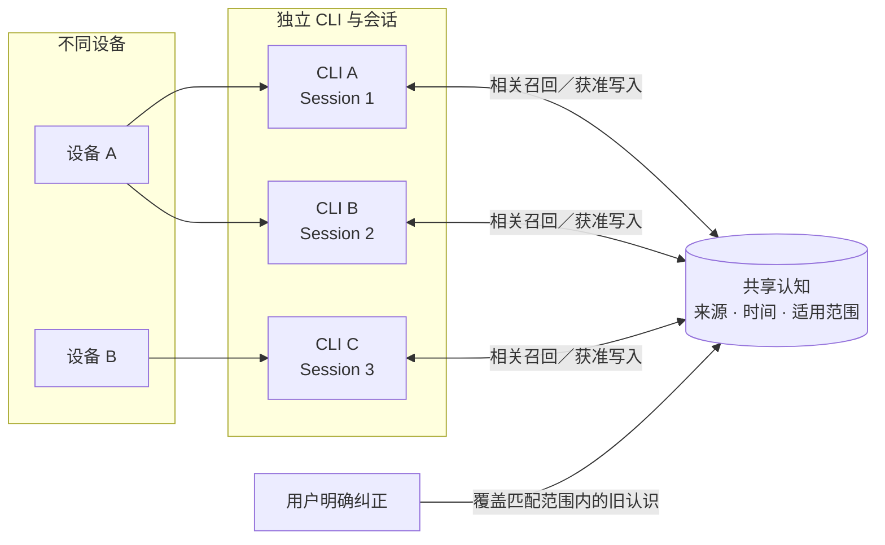
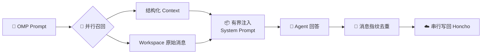

<div align="center">
  <h1>🧠 OMP Honcho Memory</h1>
  <p><strong>一个插件，让 OMP、Claude Code、Codex 与 Hermes 理解同一个你</strong></p>
  <p>基于 <a href="https://honcho.dev">Honcho</a> 的跨 CLI 记忆插件：共享核心 + 每端薄壳，一条命令安装、升级、卸载与冒烟；在模型请求前召回相关历史，只把真人交互写成用户证据。</p>
  <p>
    <a href="https://github.com/can1357/oh-my-pi"></a>
    <a href="https://bun.sh"></a>
    
    <a href="LICENSE"></a>
  </p>
</div>

> [!IMPORTANT]
> 本扩展会把获准的对话内容发送到 Honcho。安装前请确认数据范围、凭据存储方式和 Honcho 账户的数据政策；首次验证只使用非敏感的合成数据。

<p align="center">
  <a href="#core">核心能力</a> ·
  <a href="#vision">设计理念</a> ·
  <a href="#architecture">工作原理</a> ·
  <a href="#user-guide">个人用户指南</a> ·
  <a href="#agent-guide">AI／Agent 配置</a> ·
  <a href="#boundaries">可靠性与安全边界</a>
</p>

<a id="core"></a>

## ✨ 核心能力

| 能力 | 行为 |
|---|---|
| 👤 **精确身份** | 保留配置中的 Peer ID，不强制小写，也不添加 `user-`／`ai-` 前缀 |
| 🔗 **原生会话** | 使用 `sessionManager.getSessionId()`；缺少 Session ID 时拒绝回退到共享 `default` |
| 🧭 **跨会话召回** | 推荐 `chat-instance`；请求前注入有预算限制的结构化上下文与 workspace 原始消息 |
| 💾 **确认式持久化** | 串行上传消息，仅在远端确认成功后推进进程内去重状态 |
| 🔄 **生命周期保护** | 在会话切换、压缩和关闭时刷新待处理写入 |
| 🔔 **轻量反馈** | 使用中英双语瞬时通知，不长期占用 OMP 底部状态栏 |
| 🧰 **可观测工具** | 提供搜索、上下文检查、结论写入和健康检查工具 |
| 🔌 **一体化多端** | 同一包覆盖 OMP 扩展、Claude Code／Codex Hook 与 Claude 四工具 MCP；Hermes 走其原生 Honcho provider，共享同一用户与结论视图 |
| 🤖 **机器输入排除** | 按入口判定来源：交互式真人输入才写入；headless、子代理、编排器会话（`HONCHO_AUTOMATION=1`）与宿主注入块只召回不写入，从不按消息关键词判断 |
| 🩺 **低维护** | 宿主升级后跑 `smoke`；失败只改对应一个薄壳；接入异常时降级为无记忆，不阻塞主任务 |

<a id="vision"></a>

## 🌐 设计理念：多设备、多 CLI，理解同一个你

人在不同设备和 CLI 之间切换时，工具可以不同、会话可以独立，但不应每次都从零认识用户。理想状态是：获准接入的客户端共同使用一份**有来源、可纠正、会随时间更新**的用户认知，并只在当前任务需要时取用相关部分。

本仓库是这套拓扑的**一体化接入插件**，不是跨 CLI 控制中心。共享认知不会合并各端会话，也不会让一个客户端继承另一个客户端的工具、权限或指令。



| 统一什么 | 保持独立什么 |
|---|---|
| 用户身份、已确认偏好、长期背景及其来源 | 每个设备和 CLI 的会话、模型与工具 |
| 明确纠正及其适用范围 | 本地配置、凭据和访问权限 |
| 按任务相关性取用的精简上下文 | 各端的表达、推理过程和最终建议 |

> [!NOTE]
> **统一认知不等于统一答案。**它也不代表共享会话、共享权限、完整复制历史、强一致或 exactly-once。冲突无法裁决时应保留不确定性；记忆只能提供上下文，不能提升执行权限。

<a id="architecture"></a>

## ⚙️ 工作原理



| 阶段 | 核心逻辑 |
|---|---|
| **绑定** | 使用配置中的原始 Peer ID，并用 OMP 原生 Session ID 生成 Honcho Session；缺少原生 ID 时停止工作，避免聊天串线 |
| **水合** | 会话启动时读取 Peer Representation、Peer Card 和 Session Summary，建立可刷新的上下文缓存 |
| **召回** | 每个有效 Prompt 并行刷新结构化上下文，并查询最多 10 条 workspace 原始消息 |
| **注入** | 召回结果带来源与完整性标记，只进入本轮 System Prompt 的固定预算区域，不回写缓存或 Honcho |
| **持久化** | 每轮结束后按原生消息身份生成指纹，过滤已确认消息并串行上传；远端成功后才更新进程内确认集 |
| **生命周期** | 会话切换、压缩和关闭前等待已排队上传；压缩前重新水合长期记忆，关闭标记在 OMP 时限内尽力写入 |

> [!NOTE]
> 原始召回是有界的历史证据，不是当前指令或完整数据库视图；确认式重试降低丢失风险，但不承诺 exactly-once。

### 多端组成

| 端 | 接入方式 | 写入 | 召回 |
|---|---|---|---|
| OMP | `extensions/` → `~/.omp/agent/extensions/honcho-memory.js` | 仅 `mode=tui` 且有 UI 的会话 | 每轮 system prompt 注入 |
| Claude Code | `hooks/honcho-hook.ts`（SessionStart、UserPromptSubmit、Stop）+ `hooks/honcho-mcp.ts` 四工具 | 交互会话；带 `agent_id` 的子代理、`-p`／SDK 不写 | `additionalContext` 注入；MCP 搜索／列出／新增／删除结论 |
| Codex | 同一 Hook（`--host codex`） | 交互会话；`exec`／`review` 等不写 | `additionalContext` 注入 |
| Hermes | 原生 Honcho provider，仅配置（`observation.ai.observeOthers=false`、`recallSync: true`） | 由 Hermes 机器作者门排除通知、loop、heartbeat、goal 续跑 | 同步首轮召回 |

所有写入消息带 `host`、`entry_class`、`host_session_id` 元数据，任一召回条目都可追到客户端、会话与时间。共享核心位于 `core/source.ts`（入口分类与注入剥离）和 `extensions/config.ts`（按宿主解析 `~/.honcho/config.json`）。

---

<a id="user-guide"></a>

## 👤 第一部分：个人用户指南

### 1. 适用条件

- OMP 18.2.5 或更新版本。
- Bun 1.3 或更新版本。
- 可用的 Honcho workspace 和 API key。
- 你理解并接受：获准会话内容会发送到 Honcho。

OMP 的扩展 API 可能随版本变化。每次升级 OMP 后都应重新执行本文的验证步骤。

### 2. 构建

```sh
git clone https://github.com/Loveacup/omp-honcho-memory.git
cd omp-honcho-memory
bun install --frozen-lockfile
bun run check
bun run build
```

不要安装来历不明的预构建文件。当前仓库默认要求从源码构建。

### 3. 配置 Honcho

创建 `~/.honcho/config.json`。示例中的身份和 workspace 都必须替换成你自己的值：

```json
{
  "peerName": "YOUR_USER_PEER",
  "apiKey": "${HONCHO_API_KEY}",
  "hosts": {
    "omp": {
      "enabled": true,
      "workspace": "YOUR_WORKSPACE",
      "aiPeer": "omp",
      "sessionStrategy": "chat-instance",
      "sessionPeerPrefix": false,
      "observationMode": "unified",
      "saveMessages": true
    }
  }
}
```

设置环境变量并限制配置权限：

```sh
export HONCHO_API_KEY='YOUR_REAL_KEY'
chmod 600 ~/.honcho/config.json
```

环境变量优先于配置文件。`HONCHO_CONFIG_DIR` 可把配置文件位置改为
`$HONCHO_CONFIG_DIR/config.json`。其他支持项：

- `HONCHO_API_KEY`
- `HONCHO_URL`
- `HONCHO_WORKSPACE`
- `HONCHO_PEER_NAME`
- `HONCHO_USERNAME`
- `HONCHO_AI_PEER`

不要把真实 key 写入本仓库、聊天记录、截图、Issue 或公开日志。

### 4. 一条命令安装

先预览所有文件操作和 JSON 条目差异，再执行安装：

```sh
bun scripts/cognition.ts install --dry-run
bun scripts/cognition.ts install
```

命令会幂等地安装 OMP 扩展与 Claude Code／Codex Hook、安装 Claude 的四工具 stdio MCP、停用 Claude 官方 Honcho writer，并备份被替换的文件和条目。Hook 与 MCP 的 manifest 会记录安装时解析出的绝对 Node 路径。它不会重启 Hermes gateway；按命令提示自行重启相关 CLI。

### 5. 验证

```sh
bun scripts/cognition.ts smoke
```

`smoke` 不写入 Honcho；它核对安装 hash、唯一 Hook writer、Claude MCP 注册、MCP 的四工具清单、配置是否可解析，并以 `--dry-run` 合成载荷调用 Hook 与 MCP。manifest 中的 Node 路径丢失时，受影响的宿主报告 `DEGRADED`。正式跨会话验收仍应只使用不敏感的合成事实，并在 Honcho 中核对作者 Peer、Session、来源 metadata 与内容。

### 6. 界面提示

扩展不会长期显示 `connected` 状态，而是显示瞬时通知：

- `✓ Honcho 记忆已连接 · Memory connected`
- `⌕ 正在检索相关记忆 · Searching relevant memory`
- `✓ 相关记忆已载入 · Relevant memory loaded`
- `↑ 正在保存本轮记忆 · Saving turn memory`
- `✓ 本轮记忆已保存 · Turn memory saved`
- `! Honcho 记忆同步失败 · Memory sync failed`

失败通知表示本轮同步不能被视为成功。不要仅因后续对话仍可继续，就忽略同步失败。

### 7. 更新

```sh
cd omp-honcho-memory
git pull --ff-only
bun install --frozen-lockfile
bun run check
bun run build
bun scripts/cognition.ts upgrade --dry-run
bun scripts/cognition.ts upgrade
bun scripts/cognition.ts smoke
```

每次 OMP、Claude Code、Codex 或 Hermes 更新后都运行一次 `smoke`；失败时只修对应薄壳，不增加旁路 writer。

### 8. 回滚或卸载

```sh
bun scripts/cognition.ts uninstall --dry-run
bun scripts/cognition.ts uninstall
```

卸载按最新 manifest 做冲突检测和外科式还原；若目标自安装后被修改，它会明确失败而不会覆盖。卸载本地插件不会删除已经写入 Honcho 的远端数据。

---

<a id="agent-guide"></a>

## 🤖 第二部分：AI／Agent 配置

本节是执行契约，不是“看到文件存在就算完成”的安装清单。

### 1. 目标

在不泄露密钥、不覆盖其他客户端配置、不制造第二写入器的前提下：

1. 固定源码提交并从源码构建。
2. 合并 `hosts.omp`，保留配置文件中的其他 host 和未知字段。
3. 只选择一个 OMP 扩展发现入口。
4. 用合成数据证明配置解析、扩展加载、远端捕获和跨会话召回。
5. 输出可定位证据和未覆盖边界。

### 2. 必须先取得的输入

AI 在执行前必须确认以下值；不得从用户名、目录名或旧日志猜测：

```yaml
repository: https://github.com/Loveacup/omp-honcho-memory
revision: 用户指定的 tag 或 commit；未指定时记录实际 HEAD
omp_version: 目标机器实测值
omp_extension_directory: 目标机器实测发现路径
honcho_workspace: 用户明确提供
honcho_user_peer: 用户明确提供
honcho_ai_peer: omp
credential_source: 环境变量或用户批准的受保护配置
allowed_data_scope: 用户明确批准的捕获和召回范围
```

缺少 workspace、用户 Peer、凭据来源或数据授权时，停止生产接入；可以继续做不联网的构建和离线验证。

### 3. 禁止事项

AI 不得：

- 输出、回显、提交或转存真实 API key。
- 整文件覆盖 `~/.honcho/config.json`。
- 修改与 `hosts.omp` 无关的 host、目录覆盖或根级字段。
- 把 `${HONCHO_API_KEY}` 替换成真实 key 后提交。
- 同时安装项目级和用户级两份扩展。
- 使用 `default` 代替缺失的 OMP Session ID。
- 用手工 Honcho API 写入伪装成 OMP 自动捕获成功。
- 用模型“回答正确”代替远端消息读回。
- 把独立 Peer 或 Session 当作访问控制。
- 宣称 exactly-once、崩溃持久队列或跨设备兼容已经得到保证。

### 4. 推荐执行流程

#### A. 固定源码

```sh
git clone https://github.com/Loveacup/omp-honcho-memory.git
cd omp-honcho-memory
git rev-parse HEAD
bun install --frozen-lockfile
```

把实际 commit 记录到验收回执。不要只写 `main`。

#### B. 离线验证

```sh
bun run check
bun run build
bun run verify
bun -e 'const m = await import("./dist/index.js"); if (typeof m.default !== "function") throw new Error("missing extension export")'
```

任一命令非零退出即停止安装，不得跳过失败步骤。

#### C. 安全合并配置

目标 `hosts.omp`。用户 Peer 由根级 `peerName` 或环境变量 `HONCHO_PEER_NAME` 提供，不写入 host scope：

```json
{
  "enabled": true,
  "workspace": "USER_APPROVED_WORKSPACE",
  "aiPeer": "omp",
  "sessionStrategy": "chat-instance",
  "sessionPeerPrefix": false,
  "observationMode": "unified",
  "saveMessages": true
}
```

合并要求：

1. 修改前创建权限受限的备份。
2. 解析现有 JSON 后只更新 `hosts.omp`。
3. 保留其他 host、未知字段和根级配置。
4. 写入临时文件，验证 JSON 后原子替换。
5. 配置文件权限设为 `0600`。
6. 使用扩展的有效配置读回或健康检查确认最终 workspace 与 Peer；日志中不得出现 key。

#### D. 安装单一扩展

优先使用目标 OMP 已验证的用户级目录：

```sh
mkdir -p ~/.omp/agent/extensions
cp dist/index.js ~/.omp/agent/extensions/honcho-memory.js
```

安装前备份同名文件；安装后重启 OMP。若目标机器实际使用其他发现路径，以实测路径为准，不机械照抄。

#### E. 运行时验收

使用唯一、非敏感、可删除的合成标记，完成以下检查：

| 检查 | 通过条件 |
|---|---|
| 配置解析 | workspace、用户 Peer、AI Peer 与会话策略精确匹配批准值 |
| 扩展加载 | 新 OMP 会话出现一次连接通知，无重复 Honcho 扩展 |
| 请求前召回 | 出现检索与载入通知；注入内容有界且属于批准范围 |
| 自动捕获 | Honcho 远端读回用户与助手消息，作者和 Session 正确 |
| 跨会话召回 | 新会话问题不含答案，但能召回会话 A 的合成事实 |
| 失败行为 | 无凭据或网络失败时明确降级，不把失败记为成功 |
| 隔离 | 没有创建带错误前缀、错误大小写或 `default` 的身份／Session |

### 5. AI 回执模板

```yaml
repository: https://github.com/Loveacup/omp-honcho-memory
commit: 完整40位SHA
omp_version: 实测版本
install_path: 实际扩展路径
config_path: 实际配置路径
config_backup: 备份路径
workspace: 非秘密值
user_peer: 非秘密值
ai_peer: omp
session_strategy: chat-instance
checks:
  typecheck: PASS|FAIL
  build: PASS|FAIL
  verify: PASS|FAIL
  extension_load: PASS|FAIL
  remote_capture_readback: PASS|FAIL
  cross_session_recall: PASS|FAIL
  failure_path: PASS|FAIL|NOT_RUN
secret_exposure: false
uncovered:
  - 未覆盖边界
rollback: 已验证的回滚命令或步骤
```

只有适用检查全部有实际证据时才能报告完成。`NOT_RUN` 必须解释原因，不能按 PASS 处理。

---

<a id="boundaries"></a>

## 🛡️ 可靠性边界

- 远端成功后本地超时，重试仍可能产生重复消息；服务端路径不是 exactly-once。
- 上传队列仅存在于当前进程，不是崩溃后可恢复的持久 journal。
- OMP 会限制 shutdown hook 的执行时间，正常轮次持久化不能只依赖关闭事件。
- 自动长期结论提取保持克制，但仍可能把临时偏好误判为稳定偏好。
- Peer、Session 和 scope 不等于强制访问控制。

## 🔐 安全边界

- 永远不要提交 `~/.honcho/config.json`、`.env`、API key、会话转录、云端导出或运行日志。
- 首次验证只使用合成、非敏感数据。
- 每次 OMP 升级后重新检查扩展 API 和生命周期行为。
- 公开 Issue 中只放脱敏复现，不上传真实会话或配置。

## 🌱 上游归属

本项目派生自 `@citywalki/oh-my-pi-honcho-memory` 0.2.0，并针对身份精确保留、OMP 原生 Session、可靠轮次持久化、有界来源感知召回和中英双语运行通知进行了较大调整。

详见 [NOTICE](NOTICE)。

## 📄 License

MIT，详见 [LICENSE](LICENSE)。
